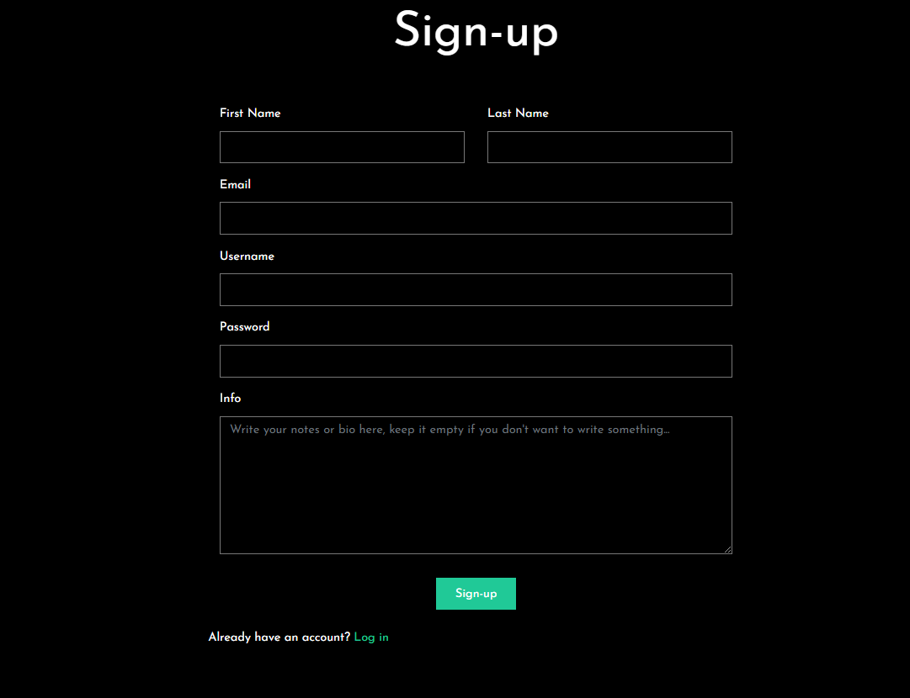

Relazione di Progetto - Social Network for Music (SNM)

Anno Accademico: 2023/2024

Corso: Programmazione Web e Mobile

Studente: Mattia De Capitani

# Introduzione
Il progetto "Social Network for Music" (SNM) si propone di sviluppare una piattaforma web per la gestione e condivisione di playlist musicali. Questo documento illustra la struttura, le funzionalità e le scelte implementative adottate, seguendo i requisiti specificati per il progetto.

# Analisi dei Requisiti
L'applicazione SNM è progettata per gestire tre macro-scenari principali:

- **Gestione degli Utenti**: Registrazione, autenticazione, e gestione dei dati degli utenti.
- **Gestione delle Playlist**: Creazione, modifica, e cancellazione di playlist, con integrazione con le API di Spotify per recuperare informazioni sui brani.
- **Gestione delle Condivisioni**: Condivisione delle playlist pubbliche, ricerca e visualizzazione delle playlist condivise.

# Identificazione delle Funzionalità
Le seguenti funzionalità sono state implementate per soddisfare i requisiti:

## Registrazione e Login:
- Gli utenti possono registrarsi, effettuare il login, e gestire il proprio profilo.
- Le informazioni raccolte includono email, username, password, e dettagli personali.

## Gestione delle Playlist:
- Gli utenti possono creare, modificare e cancellare playlist.
- Le playlist contengono informazioni sui brani, che vengono recuperate tramite le API REST di Spotify.

## Gestione delle Condivisioni:
- Gli utenti possono rendere pubbliche le proprie playlist e cercare playlist pubbliche.
- I criteri di ricerca includono tag e brani contenuti nelle playlist.

# Progettazione della Struttura e Presentazione delle Pagine Web
Le pagine web sono progettate seguendo il paradigma di separazione tra struttura (HTML5) e rappresentazione (CSS3). L'applicazione utilizza JavaScript per la logica di interazione con l'utente e per effettuare richieste al backend.

## Struttura del Progetto
La struttura del progetto è organizzata come segue:

## Backend (Node.js e MongoDB)
Gestisce i dati relativi agli utenti, playlist e condivisioni. Utilizza Mongoose per l'interazione con MongoDB e middleware per la gestione dei timestamp e della validazione.

- **/backend**: Contiene il codice sorgente del backend dell'applicazione.
  - **/config**: Configurazioni generali dell'applicazione, inclusi file di configurazione per la connessione al database e per la documentazione Swagger.
  - **/controllers**: Gestisce la logica applicativa per le varie entità (autenticazione, playlist, ricerca, utenti).
  - **/middlewares**: Middleware per l'autenticazione, la validazione, la gestione degli avatar, e altro.
  - **/models**: Definizioni dei modelli Mongoose per utenti e playlist.
  - **/routes**: Definizione delle rotte API per autenticazione, playlist, ricerca e utenti.
  - **/services**: Servizi per interagire con le API di Spotify.
  - **/uploads**: Directory per i file caricati, come immagini degli avatar.
  - **/utils**: Funzioni di utilità, incluse le validazioni.
  - **app.js**: File principale per avviare il server Express.
  - **package.json**: Gestisce le dipendenze e i comandi del progetto.
  - **.env**: File per le variabili d'ambiente.

## Frontend (HTML5, CSS3, JavaScript)
Consente agli utenti di interagire con l'applicazione. Le richieste vengono inviate al backend tramite fetch API.

> da completare

# Progettazione della Sorgente di Informazioni
## Backend
Il backend è sviluppato con Node.js e utilizza MongoDB per la memorizzazione dei dati. Le principali operazioni gestite includono:

- **Autenticazione**: Registrazione, login e gestione del profilo utente.
- **Playlist**: Creazione, modifica e cancellazione di playlist.
- **Condivisioni**: Pubblicazione e ricerca di playlist pubbliche.

Gli endpoint dell'api (backend) sono disponibili nello swagger, accessibile a `api/docs/`

## API Spotify
Per recuperare informazioni sui brani, l'applicazione utilizza le API di Spotify. Le richieste alle API sono gestite da una funzione `fetchWrapper`, che si occupa di aggiornare e utilizzare un token di accesso per l'autenticazione.

# Implementazione
## Codice del Backend
Nel database MongoDB vengono memorizzati esclusivamente gli ID relativi ad artisti, canzoni, utenti seguiti e autori delle playlist. Questo approccio permette di ottimizzare lo spazio di archiviazione, evitando la duplicazione di dati che possono essere facilmente recuperati tramite l'API di Spotify. In questo modo, il database resta leggero e rapido nelle operazioni di lettura e scrittura, concentrandosi solo sugli ID univoci necessari per identificare i contenuti.

Questa strategia è particolarmente vantaggiosa in un contesto di crescita del progetto, dove un numero sempre maggiore di utenti potrebbe portare a un incremento significativo delle richieste al database. Anziché archiviare dati ridondanti o facilmente accessibili tramite terze parti, come nel caso di Spotify, il sistema può mantenere le performance elevate anche in scenari ad alta scala.

In previsione di una crescita esponenziale del progetto, potrebbe essere utile considerare la possibilità di stipulare accordi commerciali con Spotify. Tali accordi permetterebbero di ottenere un numero maggiore di richieste per secondo e di incrementare i limiti totali delle API, assicurando che il sistema possa gestire un elevato volume di traffico senza incorrere in limitazioni imposte dal provider esterno.

Questo approccio non solo ottimizza l'uso delle risorse, ma mantiene anche il sistema flessibile e scalabile, pronto a rispondere a future esigenze di crescita. Inoltre, memorizzare solo gli ID significa ridurre significativamente la complessità della gestione dei dati, affidando la responsabilità della loro accuratezza e aggiornamento direttamente a Spotify, che è costantemente allineato con le modifiche e gli aggiornamenti del contenuto musicale.

### User Schema (user.js):
Gestisce le informazioni degli utenti, inclusi email, username, password e preferenze musicali. Utilizza Mongoose per la definizione del modello e la gestione dei dati.

```js
// File /backend/models/user.js
const mongoose = require('mongoose');
const userValidation = require('../utils/validation/user');

/**
 * Schema definition for a User in MongoDB.
 * @typedef {Object} User
 * @property {string} email - The user's email address.
 * @property {string} username - The user's unique username.
 * @property {string} password - The user's hashed password.
 * @property {string} status - The user's account status. Can be 'active', 'inactive', or 'banned'.
 * @property {string} role - The user's role. Can be 'user', 'admin', or 'superadmin'.
 * @property {Date} createdAt - The date and time when the user was created.
 * @property {string} firstName - The user's first name.
 * @property {string} lastName - The user's last name.
 * @property {string} [info] - Additional information about the user.
 * @property {Object} preferences - The user's preferences.
 * @property {string[]} preferences.artists - An array of preferred artist IDs.
 * @property {mongoose.Schema.Types.ObjectId[]} preferences.following - An array of IDs of users the user is following.
 * @property {string[]} preferences.genres - An array of preferred genre tags.
 * @property {mongoose.Schema.Types.ObjectId[]} preferences.playlists - An array of IDs of the user's playlists.
 */

/**
 * Mongoose Schema for a User.
 * @type {mongoose.Schema}
 */
const userSchema = new mongoose.Schema({
  email: {
    type: String,
    required: [true, 'Email is required'],
    unique: true,
    match: [userValidation.email.pattern, userValidation.email.description]
  },
  username: {
    type: String,
    required: [true, 'Username is required'],
    unique: true,
    match: [userValidation.username.pattern, userValidation.username.description]
  },
  password: {
    type: String,
    required: [true, 'Password is required'],
    // Passwords are hashed, so pattern validation is not applicable
  },
  status: {
    type: String,
    required: [true, 'Status is required'],
    default: 'active',
    enum: ['active', 'inactive', 'banned'] // Status can only be one of these values
  },
  role: {
    type: String,
    required: [true, 'Role is required'],
    default: 'user',
    enum: ['user', 'admin', 'superadmin'] // Role can only be one of these values
  },
  createdAt: {
    type: Date,
    default: Date.now,
    required: true // Timestamp when the user was created
  },
  firstName: {
    type: String,
    required: [true, 'First name is required'],
    match: [userValidation.firstName.pattern, userValidation.firstName.description]
  },
  lastName: {
    type: String,
    required: [true, 'Last name is required'],
    match: [userValidation.lastName.pattern, userValidation.lastName.description]
  },
  info: {
    type: String,
    default: '',
    match: [userValidation.info.pattern, userValidation.info.description] // Optional additional information
  },
  preferences: {
    artists: {
      type: [String],
      default: [],
      validate: {
        validator: userValidation.preferences.artists.isValid,
        message: userValidation.preferences.artists.description
      }
    },
    following: {
      type: [mongoose.Schema.Types.ObjectId],
      ref: 'User',
      default: [],
      validate: {
        validator: userValidation.preferences.following.isValid,
        message: userValidation.preferences.following.description
      }
    },
    genres: {
      type: [String],
      default: [],
      validate: {
        validator: userValidation.preferences.genres.isValid, // Validation for genre preferences
        message: userValidation.preferences.genres.description
      }
    },
    playlists: {
      type: [mongoose.Schema.Types.ObjectId],
      ref: 'Playlist',
      default: [],
      validate: {
        validator: userValidation.preferences.playlists.isValid,
        message: userValidation.preferences.playlists.description
      }
    }
  }
});

/**
 * User model compiled from the schema.
 * @type {mongoose.Model<User>}
 */
const User = mongoose.model('User', userSchema);

module.exports = User;
```

### Playlist Schema (playlist.js):
Gestisce le informazioni relative alle playlist, inclusi titolo, descrizione, e canzoni. Il modello prevede anche la validazione dei dati e la gestione dei timestamp tramite middleware apposito che aggiornerà automaticamente il campo `updatedAt`.

```js
// File /backend/middlewares/timestamp.js
// Middleware to update the updatedAt field before saving the document
module.exports.updateTimestamp = function (next) {
  // Setting the field updatedAt to current timestamp
  this.updatedAt = Date.now()
  next()
}

// Middleware to update the updatedAt field before a findOneAndUpdate operation
module.exports.updateTimestampForUpdate = function (next) {
  // Setting the field updatedAt to current timestamp in the update object, because the real document isn't updated until save() is performed
  this._update.updatedAt = Date.now()
  next()
}
```

```js
// Parte del file /backend/models/playlist.js
...
  updatedAt: {
    type: Date,
    default: Date.now,
    validate: {
      validator: playlistValidation.updatedAt.isValid,
      message: playlistValidation.updatedAt.description
    }
  }
...

/**
 * Middleware to update the `updatedAt` timestamp before saving a document.
 */
playlistSchema.pre('save', updateTimestamp);

/**
 * Middleware to update the `updatedAt` timestamp before finding and updating a document.
 */
playlistSchema.pre('findOneAndUpdate', updateTimestampForUpdate);

/**
 * Playlist model compiled from the schema.
 * @type {mongoose.Model<Playlist>}
 */
const Playlist = mongoose.model('Playlist', playlistSchema);

module.exports = Playlist;
```

### Validazione Utente e Playlist
I file presenti all'interno della cartella *validation* (`/backend/utils/validation/) contengono le regole di validazione per i vari campi dell'utente e delle playlists. Utilizzano espressioni regolari per verificare la validità dei dati e integrano servizi esterni per la validazione di artisti e playlist tramite l'API di Spotify.

```js
// File /backend/utils/validation/playlist.js
const mongoose = require('mongoose')
const spotifyService = require('../../services/spotify')

const playlistValidation = {
  title: {
    pattern: /^[a-zA-Z0-9\s'-]{1,30}$/,
    description: 'Title must be between 1 and 30 characters long and can contain letters, numbers, spaces, apostrophes, and hyphens',
    isValid: (value) => {
      return playlistValidation.title.pattern.test(value)
    }
  },

  description: {
    pattern: /^.{0,500}$/,
    description: 'Description must be at most 500 characters long',
    isValid: (value) => {
      return playlistValidation.description.pattern.test(value)
    }
  },

  // tag are spotify genres
  tag: {
    description: 'Tag must be a valid genre',
    isValid: async (tag) => {
      const validTags = spotifyService.genres
      return validTags.includes(tag)
    }
  },
  
  tags: {
    description: 'Tags must be an array of valid genres',
    isValid: async (tags) => {
      const validTags = spotifyService.genres
      return Array.isArray(tags) && tags.every(tag => validTags.includes(tag))
    }
  },

  song: {
    description: 'Song must be a valid Spotify track IDs',
    isValid: async (song) => {
      return spotifyService.validateId(song, 'track')
    }
  },

  songs: {
    description: 'Songs must be an array of valid Spotify track IDs',
    isValid: async (songs) => {
      return Array.isArray(songs) && songs.every(song => spotifyService.validateId(song, 'track'))
    }
  },

  owner: {
    description: 'Owner must be a valid user ID',
    isValid: (ownerId) => {
      return mongoose.isValidObjectId(ownerId)
    }
  },

  public: {
    description: 'Public status must be a boolean value',
    isValid: (value) => {
      return typeof value === 'boolean'
    }
  },

  createdAt: {
    description: 'Created at must be a valid date',
    isValid: (value) => {
      return !isNaN(Date.parse(value))
    }
  },

  updatedAt: {
    description: 'Updated at must be a valid date',
    isValid: (value) => {
      return !isNaN(Date.parse(value))
    }
  }
}

module.exports = playlistValidation
```

E' inoltre presente un middleware (`validator.js`) il quale controlla che i dati siano validi prima di eseguire il controller di ogni endpoint, in questo modo si riduce drasticamente il numero di volte che il codice viene ripetuto per validare gli input esterni.

Ogni validazione è basata sulle regole presenti nei file nella cartella validation, in questo modo in caso di future necessità è possibili modificarle una sola volta e rendendole effettive in tutto il progetto.

Infine è presente un ulteriore controllo che verifica se gli id di playlists e users siano effettivamente associati ad un documenento nel database.

```js
// File checkExistence.js
const User = require('./../models/user');
const Playlist = require('./../models/playlist');

/**
 * Middleware to check if a user exists in the database.
 * 
 * This middleware function retrieves the user by their ID from the 
 * request parameters. If the user is found, it attaches the user 
 * object to the request for further use in subsequent middleware or 
 * route handlers. If the user is not found, it sends a 404 error 
 * response. If there's an error during the database query, it sends 
 * a 500 error response.
 * 
 * @async
 * @function user
 * @param {Object} req - The request object containing the user ID in 
 * the parameters.
 * @param {Object} res - The response object used to send error 
 * responses.
 * @param {Function} next - The next middleware function to call if 
 * the user is found.
 * @returns {Promise<void>} A promise that resolves when the user is 
 * found and attached to the request object, or an error response is sent.
 * @throws {Error} Throws an error if there is an issue querying the 
 * database.
 */
module.exports.user = async (req, res, next) => {
  try {
    // Extract user ID from request parameters
    const userId = req.params.userId;

    // Find the user by ID
    const user = await User.findById(userId);
    if (!user) {
      // User not found, send a 404 response
      return res.status(404).json({ error: { message: 'User not found' } });
    }

    // Attach user to request object for further use
    req.user = user;

    // Proceed to the next middleware function
    next();
  } catch (error) {
    // Handle any unexpected errors
    console.error(error.message);
    res.status(500).json({ error: { message: "It's not you, it's us" } });
  }
}

/**
 * Middleware to check if a playlist exists in the database.
 * 
 * This middleware function retrieves the playlist by its ID from the 
 * request parameters. If the playlist is found, it attaches the 
 * playlist object to the request for further use in subsequent middleware 
 * or route handlers. If the playlist is not found, it sends a 404 error 
 * response. If there's an error during the database query, it sends 
 * a 500 error response.
 * 
 * @async
 * @function playlist
 * @param {Object} req - The request object containing the playlist ID 
 * in the parameters.
 * @param {Object} res - The response object used to send error 
 * responses.
 * @param {Function} next - The next middleware function to call if 
 * the playlist is found.
 * @returns {Promise<void>} A promise that resolves when the playlist is 
 * found and attached to the request object, or an error response is sent.
 * @throws {Error} Throws an error if there is an issue querying the 
 * database.
 */
module.exports.playlist = async (req, res, next) => {
  try {
    // Extract playlist ID from request parameters
    const playlistId = req.params.playlistId;

    // Find the playlist by ID
    const playlist = await Playlist.findById(playlistId);
    if (!playlist) {
      // Playlist not found, send a 404 response
      return res.status(404).json({ error: { message: 'Playlist not found' } });
    }

    // Attach playlist to request object for further use
    req.playlist = playlist;

    // Proceed to the next middleware function
    next();
  } catch (error) {
    // Handle any unexpected errors
    console.error(error.message);
    res.status(500).json({ error: { message: "It's not you, it's us" } });
  }
}

```

Esempio di utilizzo dei middleware in uno specifico endpoint del progetto:

`router.post('/playlist/:playlistId', verifyToken, validator, checkExistence.playlist, userController.addPlaylist);`
### 

## Codice del Frontend
Il frontend del progetto utilizza HTML5 per la struttura delle pagine web, CSS3 per la stilizzazione e JavaScript per le interazioni dinamiche. Le interazioni con il backend sono gestite tramite chiamate AJAX, che aggiornano la UI in base alle risposte ricevute. Lo stile della pagina è gestito basandosi su boostrap che utilizza internamente anche jquery.

L'obiettivo iniziale era sviluppare una Single Page Application (SPA). Tuttavia, l'adozione di framework JavaScript come React o Vue avrebbe comportato un incremento significativo della complessità del progetto, introducendo una quantità notevole di codice superfluo, derivante dai pacchetti base di tali framework.

Per semplificare lo sviluppo e mantenere il progetto più snello, è stata adottata un'approccio alternativo. Invece di utilizzare un framework, i è stato emulato il comportamento di una SPA utilizzando la proprietà CSS `display`. Le pagine vengono gestite nascondendo e mostrando sezioni del contenuto tramite le proprietà `display: none` e `display: block`.

La logica per la gestione della visualizzazione delle diverse sezioni della pagina è centralizzata nel file spa.js. Questo script contiene funzioni come `displayHome()`, `displayPlaylist()`, e altre, che modificano dinamicamente la visibilità delle sezioni della pagina in base alle azioni dell'utente. Questo approccio riduce la complessità e mantiene il codice più semplice e gestibile, senza rinunciare alla funzionalità di una SPA.

Una ulteriore funzione che non è stata implementata sarebbe stata quella di campiare il comportamento delle freccie back e fardward aggiungendo tramite le funzioni pushState ecc. degli oggetti che indicassero il nome dell'ultima sezione resa visibile e gli eventuali paremetri passati come l'id della playlist o dell'utente

### Funzionalità Aggiuntive Non Implementate
Un'ulteriore funzionalità prevista ma non implementata riguarda la gestione della navigazione tramite le frecce "Back" e "Forward" del browser, e la manipolazione della cronologia di navigazione. Questa funzionalità avrebbe comportato l'uso delle API History di JavaScript, come `pushState` e `replaceState`, per gestire dinamicamente la cronologia e migliorare l'esperienza utente.

L'idea era di aggiornare lo stato della cronologia del browser ogni volta che l'utente naviga tra le diverse sezioni della SPA. Questo avrebbe permesso di:

- **Preservare lo Stato della Navigazione**: Memorizzare lo stato corrente della pagina, inclusi i dettagli come il nome della sezione visualizzata e gli eventuali parametri, come l'ID della playlist o dell'utente.
- **Supportare la Navigazione del Browser**: Consentire agli utenti di utilizzare le frecce di navigazione "Back" e "Forward" del browser per tornare alle pagine precedenti o avanzare verso quelle successive senza ricaricare la pagina.

L'implementazione di questa funzionalità avrebbe migliorato l'usabilità dell'applicazione, consentendo agli utenti di navigare tra le diverse sezioni in modo più fluido e naturale, mantenendo la cronologia delle navigazioni e permettendo l'uso delle funzioni di navigazione del browser. Tuttavia, per mantenere la semplicità del progetto, questa funzionalità è stata accantonata in favore di un approccio più semplice basato sulla manipolazione del CSS per la gestione delle visualizzazioni.

#### Implementazione Proposta
Se questa funzionalità fosse stata implementata, le modifiche sarebbero avvenute principalmente nel file spa.js. Ecco come la gestione della cronologia e della navigazione sarebbe stata integrata utilizzando le funzioni displayHome(), displayPlaylist(playlist_id), displayUser(userId), e altre simili.

Ogni volta che una nuova sezione viene visualizzata, la funzione pushState sarebbe stata utilizzata per aggiungere un nuovo stato alla cronologia del browser. Questo stato includerebbe informazioni come il nome della sezione e i parametri associati.
```js
function displaySection(sectionName, params) {
  // Nascondi tutte le sezioni
  document.querySelectorAll('.section').forEach(section => {
    section.style.display = 'none';
  });
  
  // Mostra la sezione desiderata
  switch (sectionName) {
    case 'home':
      displayHome();
      break;
    case 'playlist':
      displayPlaylist(params.playlist_id);
      break;
    case 'user':
      displayUser(params.userId);
      break;
    default:
      displayHome();
  }

  // Aggiorna lo stato della cronologia
  const state = { section: sectionName, params: params };
  const title = `Pagina: ${sectionName}`;
  const url = `?section=${sectionName}&${new URLSearchParams(params).toString()}`;
  history.pushState(state, title, url);
}
```

La funzione popState sarebbe stata utilizzata per gestire gli eventi di navigazione all'interno dell'applicazione, ripristinando lo stato della pagina in base all'oggetto di stato salvato nella cronologia.

```js
window.addEventListener('popstate', (event) => {
  if (event.state) {
    const { section, params } = event.state;
    displaySection(section, params);
  }
});

```

Al caricamento della pagina, il codice avrebbe verificato la presenza di uno stato salvato nella cronologia e avrebbe visualizzato la sezione appropriata.
```js
document.addEventListener('DOMContentLoaded', () => {
  const queryParams = new URLSearchParams(window.location.search);
  const sectionName = queryParams.get('section') || 'home';
  const params = {};
  
  // Estrai eventuali parametri aggiuntivi
  if (sectionName === 'playlist') {
    params.playlist_id = queryParams.get('playlist_id');
  } else if (sectionName === 'user') {
    params.userId = queryParams.get('userId');
  }

  displaySection(sectionName, params);
});

```

# Gestione del Login e delle Autenticazioni
Nel sistema, l'autenticazione degli utenti è gestita tramite token JWT (JSON Web Token). Questi token, che scadono ogni 30 minuti per motivi di sicurezza, possono essere facilmente configurati cambiando i valori nel file .env. Per garantire che le richieste al backend siano adeguatamente autorizzate, è stata implementata una funzione wrapper fetchProtectedResource nel frontend, che accoda automaticamente il token JWT a ogni richiesta inviata.

per generare la chiave presente nel file `.env`:

```js
const crypto = require('crypto');
const JWT_SECRET = crypto.randomBytes(32).toString('hex');
console.log(JWT_SECRET)
```

oppure `openssl rand -base64 32`

## Middleware di Autenticazione
Il middleware verifyToken è utilizzato per verificare l'autenticità e la validità del token JWT presente nelle richieste in arrivo. Se il token è valido, l'ID utente e l'oggetto utente vengono allegati alla richiesta per l'utilizzo nelle funzioni successive.

```js
const verifyToken = async (req, res, next) => {
  try {
    // Estrai il token dall'header Authorization
    const authHeader = req.headers['authorization'];
    const token = authHeader && authHeader.split(' ')[1];

    // Verifica se il token è presente
    if (!token) {
      return res.status(401).json({ error: { message: 'No Token inserted' } });
    }

    // Verifica il token
    jwt.verify(token, process.env.JWT_SECRET, async (err, decoded) => {
      if (err) {
        if (err.name === 'TokenExpiredError') {
          return res.status(401).json({ error: { message: 'Token has expired' } });
        }
        return res.status(401).json({ error: { message: 'Invalid Token' } });
      }

      // Verifica che l'ID utente nel token sia valido
      if (!mongoose.isValidObjectId(decoded.userId)) {
        return res.status(500).json({ error: { message: "It's not you, it's us" } });
      }

      // Trova l'utente nel database
      const user = await User.findById(decoded.userId);
      if (!user) {
        return res.status(404).json({ error: { message: 'User not found' } });
      }

      // Allegare l'ID utente e l'oggetto utente alla richiesta
      req.userId = decoded.userId;
      req.userLogged = user;

      next();
    });
  } catch (error) {
    console.error(error.message);
    return res.status(500).json({ message: "It's not you, it's us" });
  }
};
```

## Controller per il Login
Il controller login gestisce il processo di autenticazione, confrontando la password fornita con quella memorizzata nel database (hashata con bcrypt). Se la password è valida, viene generato un token JWT per l'utente.

```js
module.exports.login = async (req, res) => {
  try {
    const { username, password } = req.body;

    const user = await User.findOne({ username });
    if (!user) {
      return res.status(401).json({ error: { message: `Invalid Username` } });
    }

    const isPasswordValid = await bcrypt.compare(password, user.password);
    if (!isPasswordValid) {
      return res.status(401).json({ error: { message: `Invalid Password` } });
    }

    const token = jwt.sign({ userId: user._id }, process.env.JWT_SECRET, { expiresIn: process.env.JWT_EXPIRATION });
    return res.status(200).json({ token: token, userId: user._id });

  } catch (err) {
    console.error(err.message);
    return res.status(500).json({ message: "It's not you, it's us" });
  }
};
```
## Creazione di un Nuovo Utente
Il controller create si occupa della creazione di un nuovo utente, effettuando l'hashing della password con bcrypt prima di salvarla nel database.
```js
module.exports.create = async (req, res) => {
  try {
    const { email, username, password, firstName, lastName, info } = req.body;

    if (!email) return res.status(400).json({ error: { message: 'Email is required' } });
    if (!username) return res.status(400).json({ error: { message: 'Username is required' } });
    if (!password) return res.status(400).json({ error: { message: 'Password is required' } });
    if (!firstName) return res.status(400).json({ error: { message: 'First name is required' } });
    if (!lastName) return res.status(400).json({ error: { message: 'Last name is required' } });

    const hashedPassword = await bcrypt.hash(password, 10);
    const user = new User({
      email,
      username,
      password: hashedPassword,
      firstName,
      lastName,
      info,
    });

    await user.save();
    return res.status(201).json({ userId: user._id });
  } catch (error) {
    if (error.code === 11000) {
      return res.status(409).json({ error: { message: 'Username or email already exists' } });
    } else if (error.name === 'ValidationError') {
      const errorMessages = Object.values(error.errors).map(err => err.message);
      return res.status(400).json({ error: { message: 'Validation error. Try again. If the problem persists contact the administrator' } });
    } else {
      console.error(error.message);
      return res.status(500).json({ error: { message: "It's not you, it's us" } });
    }
  }
};

```

## Sicurezza delle Password
Le password degli utenti non vengono mai memorizzate in chiaro nel database. Utilizzando il modulo bcrypt, le password vengono hashate con un salt casuale, il quale viene automaticamente concatenato alla password stessa. Questo approccio garantisce che, anche in caso di violazione del database, le password degli utenti rimangano sicure. Per una sicurezza ulteriore, il salt potrebbe essere salvato in un database separato, isolando ulteriormente le informazioni critiche.

## Gestione dei Token nel Frontend
Nel frontend, le richieste alla API di Spotify (o altre API protette) vengono effettuate utilizzando una funzione wrapper fetchProtectedResource. Questa funzione si assicura che il token JWT venga incluso in ogni richiesta.

```js
/**
 * Function to make protected requests with JWT authentication.
 * Automatically includes the JWT token stored in localStorage in all requests.
 * If the response is 401 (Unauthorized), it redirects the user to the login page.
 * 
 * @param {string} url - The URL of the resource to fetch.
 * @param {string} [method='GET'] - The HTTP method to use (GET, POST, etc.).
 * @param {Object|null} [body=null] - The request body, if any.
 * @returns {Promise<Response>} The fetch response.
 */
async function fetchProtectedResource(url, method = 'GET', body = null) {
  // Retrieve the authentication token from localStorage
  let token = localStorage.getItem('authToken');

  // Set up the request headers
  const headers = {
    'Authorization': `Bearer ${token}`,
  };

  // Add the 'Content-Type' header only if the body is not FormData
  if (!(body instanceof FormData)) {
    headers['Content-Type'] = 'application/json';
  }

  // Execute the fetch request
  let response = await fetch(url, {
    method: method,
    headers: headers,
    body: body && !(body instanceof FormData) ? JSON.stringify(body) : body,
  });

  // If the response is 401, redirect to the login page
  if (response.status === 401) {
    displayLogin(); // Function to show the login page
  }

  return response; // Return the response for further processing
}

/**
 * Function to refresh the authentication token.
 * Used to log in and save the new token in localStorage.
 * If the login fails, it displays an error message.
 * 
 * @param {Event} event - The form submit event.
 */
const refreshToken = async (event) => {
  event.preventDefault(); // Prevent the default form submission behavior

  // Retrieve the username and password values from input fields
  const usernameInput = document.getElementById('username-input');
  const passwordInput = document.getElementById('password-input');

  const username = usernameInput.value;
  const password = passwordInput.value;

  // Send a login request
  const response = await fetch('/api/auth/login', {
    method: 'POST',
    headers: {
      'Content-Type': 'application/json',
    },
    body: JSON.stringify({
      username: username,
      password: password, 
    }),
  });

  const data = await response.json(); // Parse the JSON response

  // If the response is not OK, display an error message
  if (!response.ok) {
    const loginError = document.getElementById('login-error');
    loginError.innerText = data.error.message;
    return;
  }

  // Save the token and user ID in localStorage
  localStorage.setItem('userId', data.userId);
  localStorage.setItem('authToken', data.token);

  // Redirect the user to the homepage
  location.href = './';

  return;
};

/**
 * Function to log out the user.
 * Removes the authentication token and user ID from localStorage.
 * Redirects the user to the preview page and hides the navigation bar.
 * 
 * @param {Event} event - The click event of the logout button.
 */
const logout = (event) => {
  event.preventDefault(); // Prevent the default button click behavior

  // Remove the token and user ID from localStorage
  localStorage.removeItem('authToken');
  localStorage.removeItem('userId');

  // Show the preview page and hide the navigation bar
  displayPreview(); // Function to show the preview page
  hideNav(); // Function to hide the navigation bar

  return;
};
```
# Prove di Funzionamento
Le seguenti schermate dimostrano le funzionalità principali dell'applicazione:

## Schermata di registrazione con campi per email, username e password.


## Schermata di login per autenticazione degli utenti.


## Home


## Gestione Profilo:


## Create Playlist


## Interfaccia per la modifica delle playlist.


## Ricerca delle playlist


## Search 


> All'interno della cartella testing, nel backend, sono presenti dei file json con degli account o delle playlist da creareare o in parte già creati

> per avviare il server `npm i` + `node app.js` dalla cartella backend

